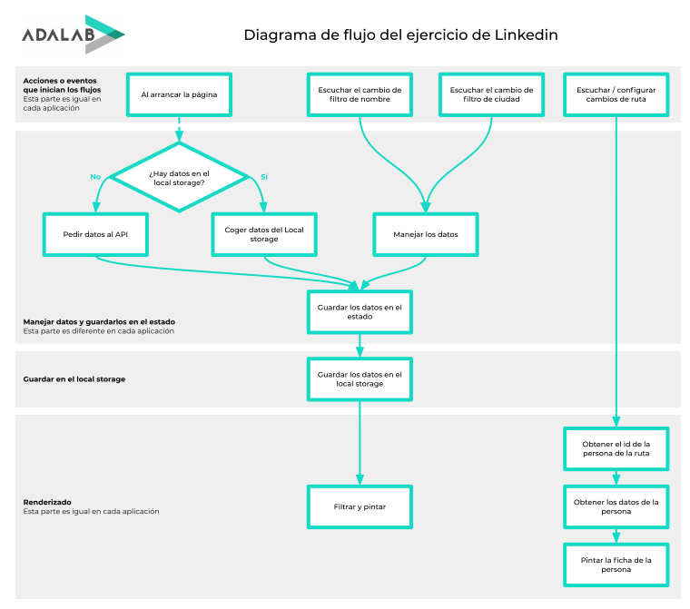

Módulo 3 - React

# Repaso final

Ejercicio de repaso final: **LinkedIn**

[ejercicios-extra/react-linkedin](https://github.com/Adalab/ejercicios-extra/tree/master/react-linkedin)

---



---

# Instalación y configuración

Requisitos: necesitas `node` and `npm` instalados en tu equipo.

### Clonar el repositorio

```
git clone URL
```

### Instalar las dependencias

```
npm install
```

### Ejecutar la aplicación

```
npm start
```

Ir a [http://localhost:3000](http://localhost:3000) para ver la aplicación en el navegador.

### Desplegar para entorno de producción

```
npm run build
```

---

# Installation and setup

Requirements: you need `node` and `npm` installed on your computer.

### Clone the repo

```
git clone URL
```

### Install the dependencies

```
npm install
```

### Run the app

```
npm start
```

Go to [http://localhost:3000](http://localhost:3000) to view the app in the browser.

### Deploy for production environment

```
npm run build
```

---

# My React Starter Kit ✨

- NPM dependencies: `node-sass` `node-uuid` `react-router-dom@5.3.0` `prop-types`
- Services: API and Local Storage
- Publish in GitHub Pages: `npm run githubpages`

---

_Happy coding!_
